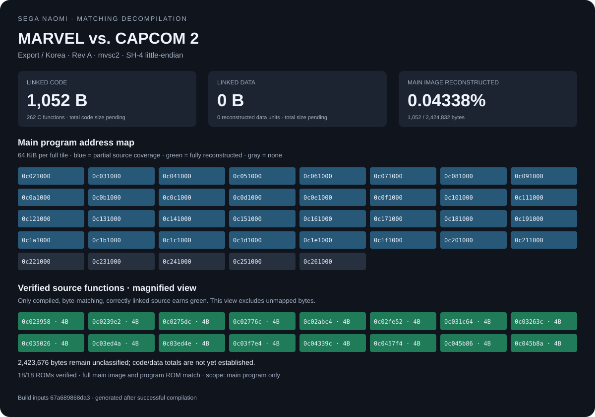

# Marvel vs. Capcom 2 — NAOMI decompilation

A private, byte-exact C reconstruction of **mvsc2, Export/Korea Rev A**. The reference ROM set, Hitachi SHC 5.0R31 compiler/linker, and wibo runtime are included. Python 3.10+ and Git are the only additional build dependencies on supported hosts.

## Start here

```sh
git clone https://github.com/g-guthrie/mvc2-naomi-decomp.git
cd mvc2-naomi-decomp
python3 tools/build.py check
```

Use native **Linux x86_64**, **macOS** (Rosetta required on Apple Silicon), or Windows. Linux ARM and x86 containers emulated on ARM are not supported. GitHub Actions supplies the tested native Linux build when your agent runs elsewhere. No container setup or separate compiler download is required.

The command verifies all 18 ROM members and bundled tool hashes, exercises the Hitachi linker, builds every registered C unit, checks addresses/sizes/bytes, reconstructs the main image and program ROM, and refreshes the progress views. A failed verified unit fails the build. Candidates may differ and receive zero credit.

## Progress

<!-- progress:start -->
**4 / 2,424,832 main-image bytes verified from Hitachi C** (0.000165%).



[Active source-unit zoom](assets/active.svg) · [Build evidence](docs/progress.json) · [Interactive treemap](docs/index.html)
<!-- progress:end -->

The map follows the charcoal/blue/green treemap style: **gray** is unmapped, **blue** is candidate C, **green** is exact verified C. Area reflects reference bytes. Gray subdivisions are display regions, not discovered functions. The active-unit zoom makes the small initial candidates visible.

Code/data bars are lower bounds until their totals are mapped. The source metric currently covers the **2,424,832-byte main executable**. The separate test executable and graphics/audio ROMs remain outside that metric. Original remainder bytes make the reconstructed image exact but do not count as decompiled source.

Open `docs/index.html` locally for the interactive map, or serve it with `python3 -m http.server --directory docs`. GitHub displays the static SVG in this README. Successful main-branch CI updates these views automatically.

## Give this repository to an agent

> Read AGENTS.md and docs/CONTINUE.md. Run python3 tools/build.py check. Choose one small function, reconstruct it as C using the bundled Hitachi tools, and require a complete byte match at its original address before crediting it. Keep the baseline green and report the exact change and validation.

- [Agent rules](AGENTS.md)
- [Next steps and unit workflow](docs/CONTINUE.md)
- [Compiler, platform support, and proof boundaries](docs/TOOLCHAIN.md)
- [Reference ROM manifest](config/target.json)
- [Build and verification](https://github.com/g-guthrie/mvc2-naomi-decomp/actions/workflows/build.yml)

The previous foundation is preserved in the `pre-hitachi-foundation-20260915` Git tag. The active branch starts with one verified no-op and two unverified C candidates. The original compiler revision/options for the whole game are not yet proven; the included toolchain is a working matching baseline.
